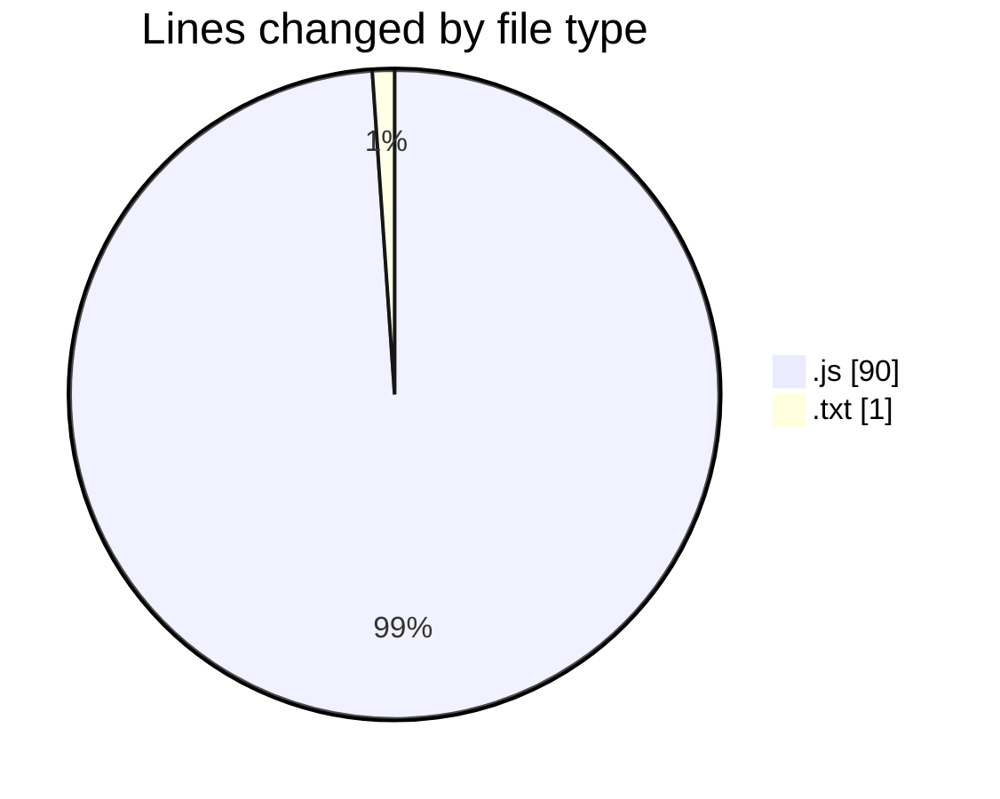
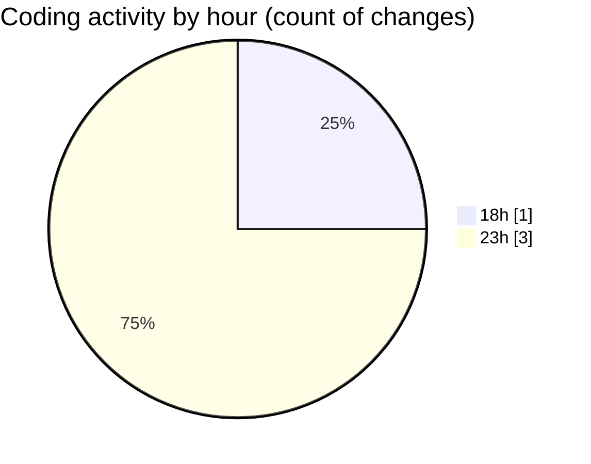

# nodeJS - Activity Summary 

## Overall Statistics

| Stat                   | Value                                                             |
| ---------------------- | ----------------------------------------------------------------- |
| **Lines Added** (➕)   | 91                                          |
| **Lines Removed** (➖) | 0                                        |
| **Net Change** (↕)    | 91                |
| **Active Time** (⌚)   | 2 minutes |

## Modified Files
- **app.js** (+38, -0)
- **routes.js** (+52, -0)
- **message.txt** (+1, -0)

## Visualizations

### By File Type (Lines Changed)

### By Hour (Estimated Activity Count)

> **Last Updated:** 3/17/2025, 11:21:16 PM