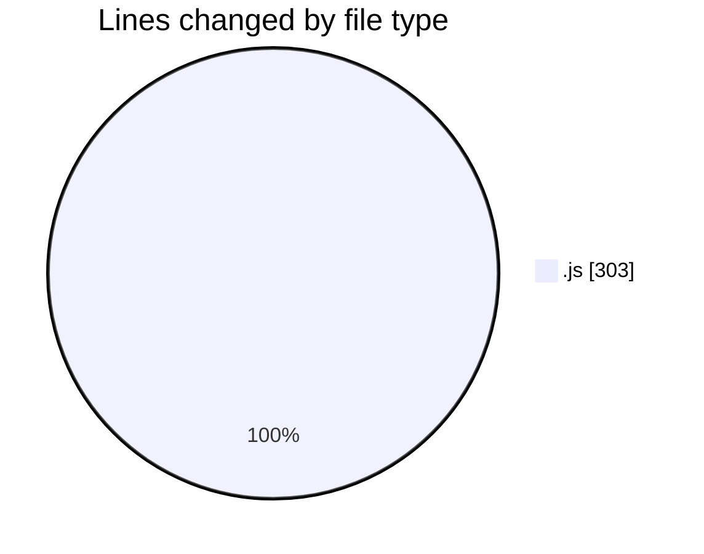
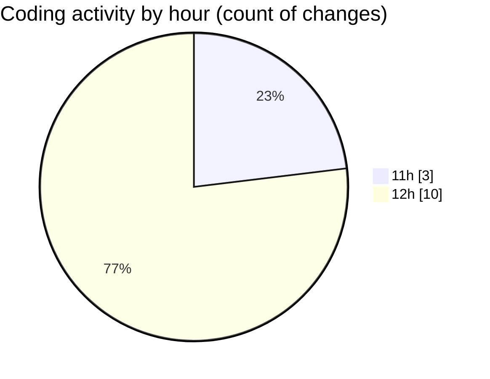

# javascript - Activity Summary 

## Overall Statistics

| Stat                   | Value                                                             |
| ---------------------- | ----------------------------------------------------------------- |
| **Lines Added** (➕)   | 220                                          |
| **Lines Removed** (➖) | 83                                        |
| **Net Change** (↕)    | 137                |
| **Active Time** (⌚)   | 15 minutes |

## Modified Files
- **createPreviewComponent.js** (+1, -0)
- **render.js** (+50, -26)
- **createContentComponent .js** (+50, -27)
- **render.js** (+51, -30)
- **previewComponent.js** (+45, -0)
- **contentComponent .js** (+23, -0)

## Visualizations

### By File Type (Lines Changed)

### By Hour (Estimated Activity Count)

> **Last Updated:** 3/21/2025, 12:21:56 PM