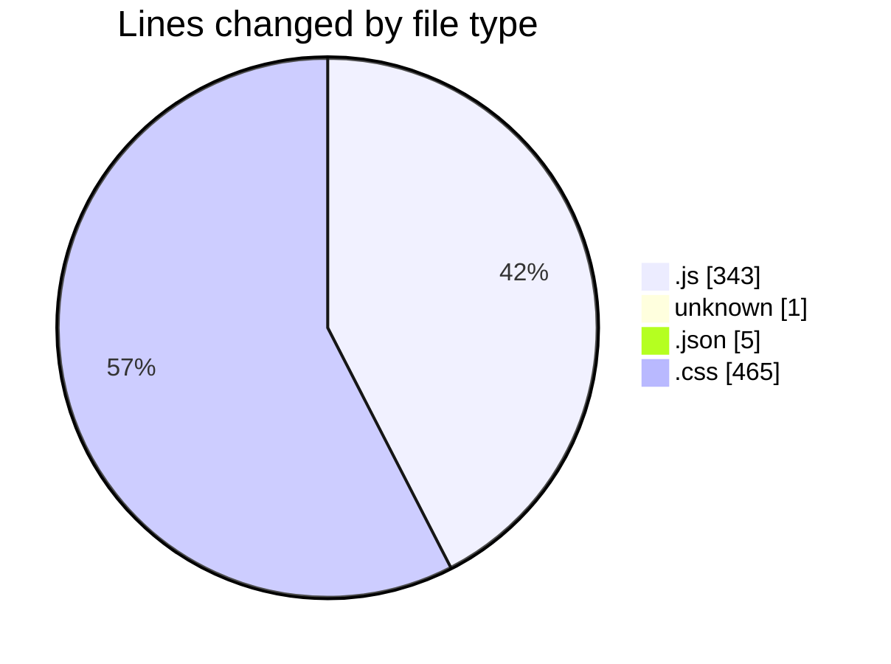
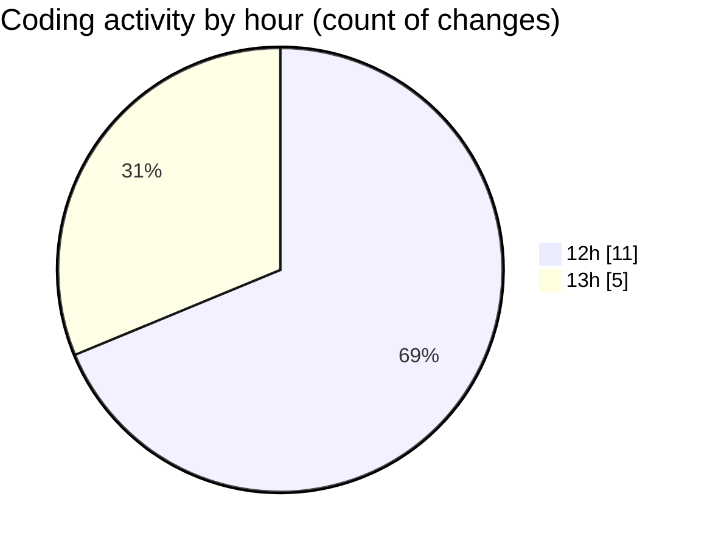

# VMS-Backend - Activity Summary 

## Overall Statistics

| Stat                   | Value                                                             |
| ---------------------- | ----------------------------------------------------------------- |
| **Lines Added** (➕)   | 814                                          |
| **Lines Removed** (➖) | 0                                        |
| **Net Change** (↕)    | 814                |
| **Active Time** (⌚)   | 17 minutes |

## Modified Files
- **server.js** (+34, -0)
- **index.js** (+9, -0)
- **userRoutes** (+1, -0)
- **user.js** (+21, -0)
- **vehicle.js** (+29, -0)
- **settings.json** (+5, -0)
- **index.js** (+91, -0)
- **index.js** (+91, -0)
- **styles.css** (+465, -0)
- **server.js** (+34, -0)
- **mainApp.js** (+34, -0)

## Visualizations

### By File Type (Lines Changed)

### By Hour (Estimated Activity Count)

> **Last Updated:** 3/27/2025, 1:29:16 PM