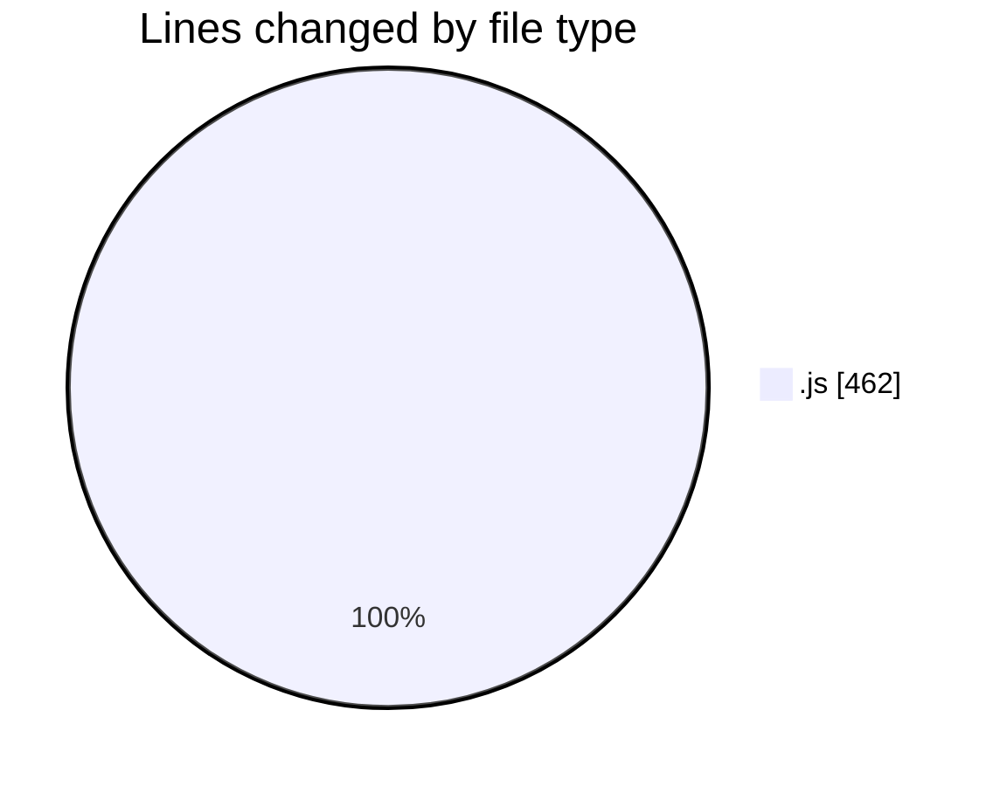
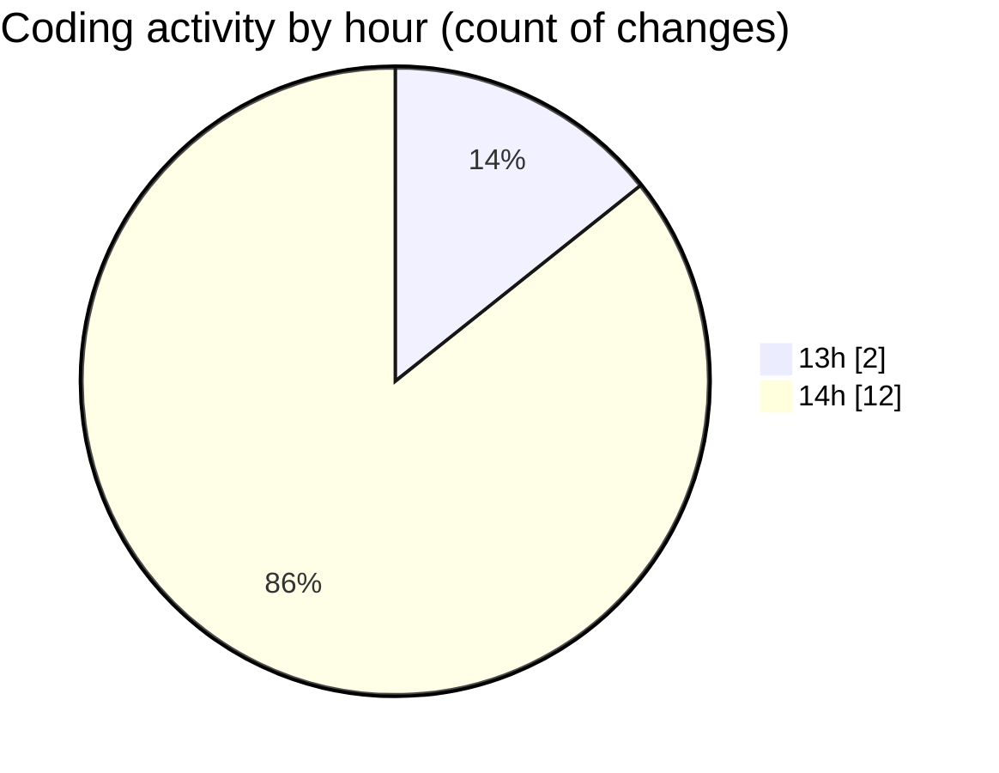

# VMS-with-Backend - Activity Summary 

## Overall Statistics

| Stat                   | Value                                                             |
| ---------------------- | ----------------------------------------------------------------- |
| **Lines Added** (➕)   | 415                                          |
| **Lines Removed** (➖) | 47                                        |
| **Net Change** (↕)    | 368                |
| **Active Time** (⌚)   | 14 minutes |

## Modified Files
- **userRoutes.js** (+1, -0)
- **vehicleRoutes.js** (+12, -0)
- **vehicle.js** (+31, -0)
- **connection.js** (+1, -0)
- **car.js** (+141, -46)
- **vehicle.js** (+141, -1)
- **user.js** (+88, -0)

## Visualizations

### By File Type (Lines Changed)

### By Hour (Estimated Activity Count)

> **Last Updated:** 3/27/2025, 2:58:56 PM