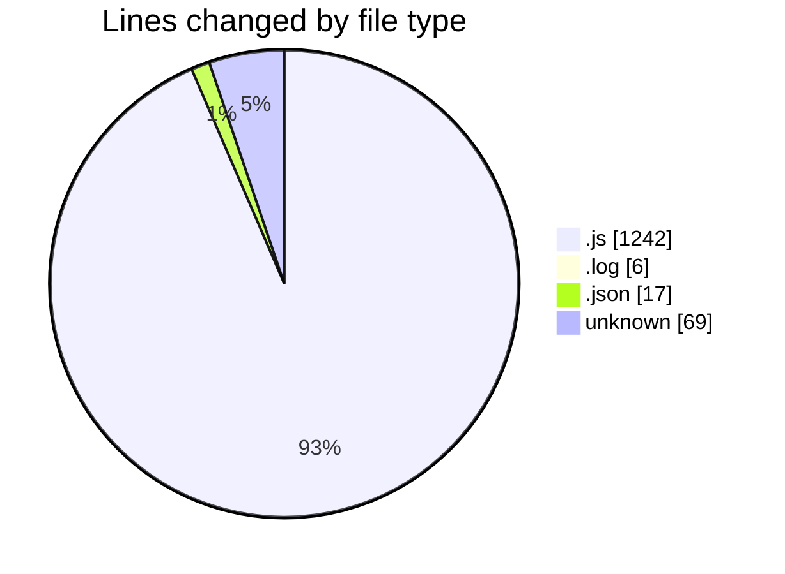
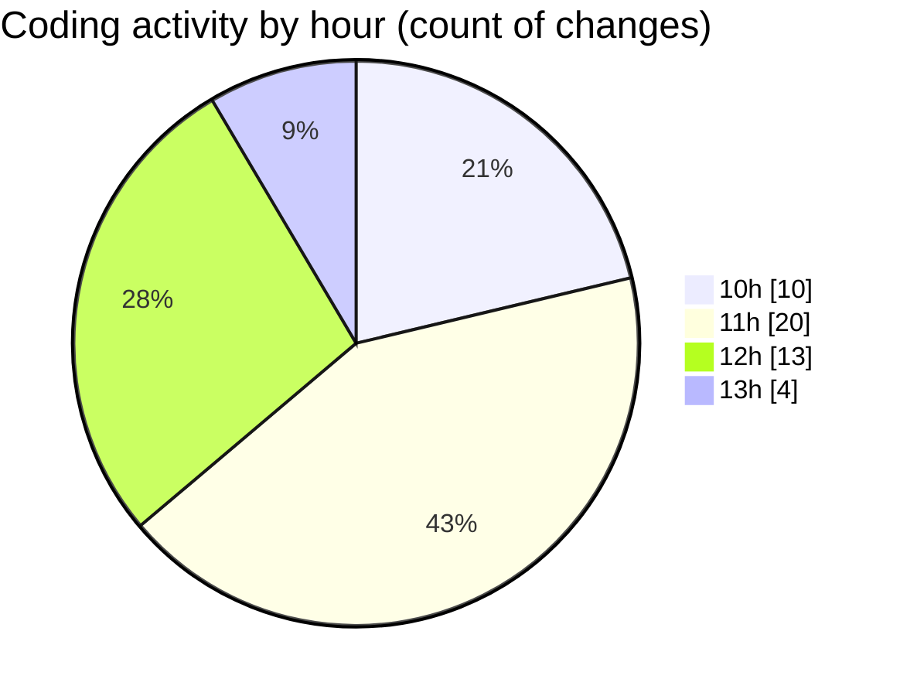

# JsVMS - Activity Summary 

## Overall Statistics

| Stat                   | Value                                                             |
| ---------------------- | ----------------------------------------------------------------- |
| **Lines Added** (➕)   | 1246                                          |
| **Lines Removed** (➖) | 88                                        |
| **Net Change** (↕)    | 1158                |
| **Active Time** (⌚)   | 83 minutes |

## Modified Files
- **inputData.js** (+61, -4)
- **index.js** (+91, -1)
- **logIn.js** (+97, -0)
- **applyFilters.js** (+69, -0)
- **addCar.js** (+189, -0)
- **addUser.js** (+115, -0)
- **populateFilters.js** (+31, -0)
- **displayCars.js** (+49, -0)
- **selectbox.js** (+69, -2)
- **logIn.js** (+97, -0)
- **checkboxes.js** (+79, -23)
- **inputData.js** (+59, -0)
- **server.js** (+148, -58)
- **access.log** (+6, -0)
- **package.json** (+17, -0)
- **.gitignore** (+23, -0)
- **.gitignore** (+23, -0)
- **.gitignore** (+23, -0)

## Visualizations

### By File Type (Lines Changed)

### By Hour (Estimated Activity Count)

> **Last Updated:** 3/31/2025, 1:09:17 PM