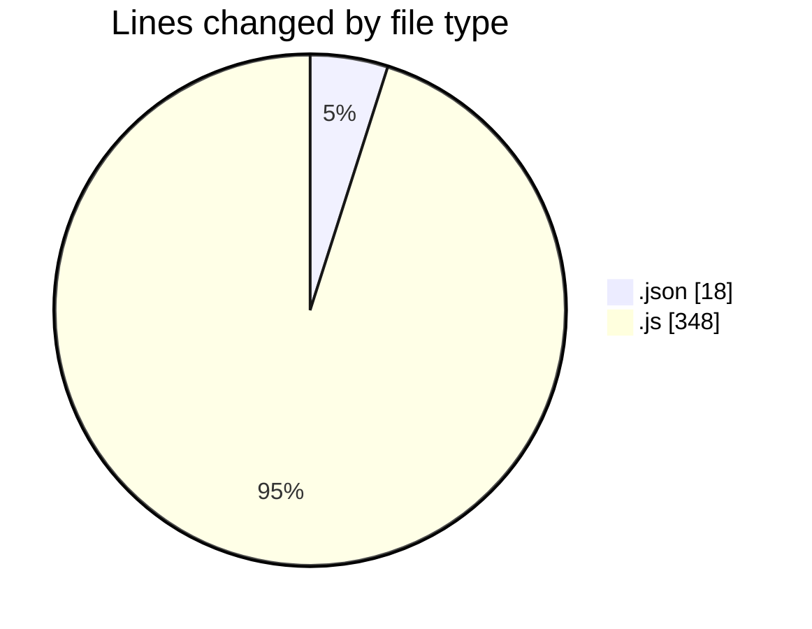
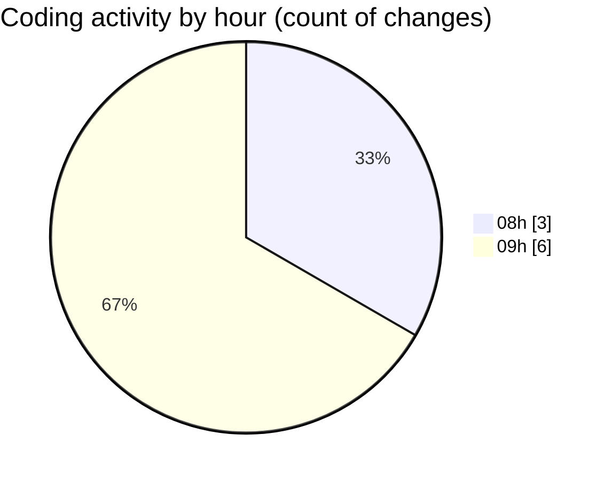

# JsVMS - Activity Summary 

## Overall Statistics

| Stat                   | Value                                                             |
| ---------------------- | ----------------------------------------------------------------- |
| **Lines Added** (➕)   | 366                                          |
| **Lines Removed** (➖) | 0                                        |
| **Net Change** (↕)    | 366                |
| **Active Time** (⌚)   | 14 minutes |

## Modified Files
- **package.json** (+18, -0)
- **server.js** (+78, -0)
- **ajax.js** (+45, -0)
- **userApi.js** (+45, -0)
- **userApi copy.js** (+45, -0)
- **carApi.js** (+45, -0)
- **ApiCar.js** (+45, -0)
- **ApiUser.js** (+45, -0)

## Visualizations

### By File Type (Lines Changed)

### By Hour (Estimated Activity Count)

> **Last Updated:** 4/1/2025, 9:57:23 AM