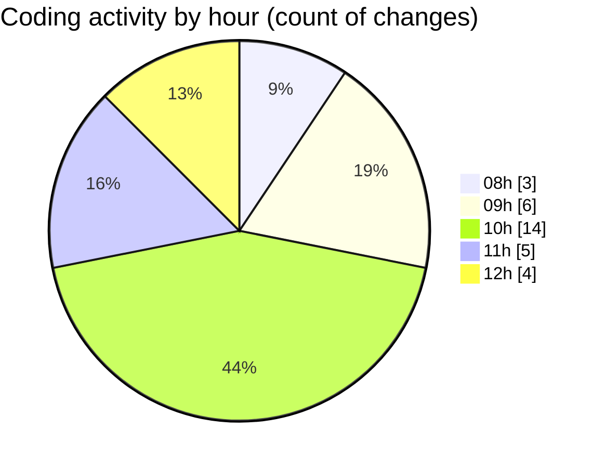

# JsVMS - Activity Summary 

## Overall Statistics

| Stat                   | Value                                                             |
| ---------------------- | ----------------------------------------------------------------- |
| **Lines Added** (➕)   | 948                                          |
| **Lines Removed** (➖) | 77                                        |
| **Net Change** (↕)    | 871                |
| **Active Time** (⌚)   | 43 minutes |

## Modified Files
- **package.json** (+18, -0)
- **server.js** (+81, -0)
- **ajax.js** (+45, -0)
- **userApi.js** (+45, -0)
- **userApi copy.js** (+45, -0)
- **carApi.js** (+45, -0)
- **ApiCar.js** (+68, -67)
- **ApiUser.js** (+68, -0)
- **connection.js** (+78, -0)
- **userRoutes.js** (+63, -0)
- **user.js** (+149, -8)
- **addUser.js** (+144, -1)
- **userApi.js** (+68, -0)
- **index.js** (+9, -0)
- **settings.js** (+7, -0)
- **vehicleRoutes.js** (+15, -1)

## Visualizations

### By File Type (Lines Changed)

### By Hour (Estimated Activity Count)

> **Last Updated:** 4/1/2025, 12:07:23 PM