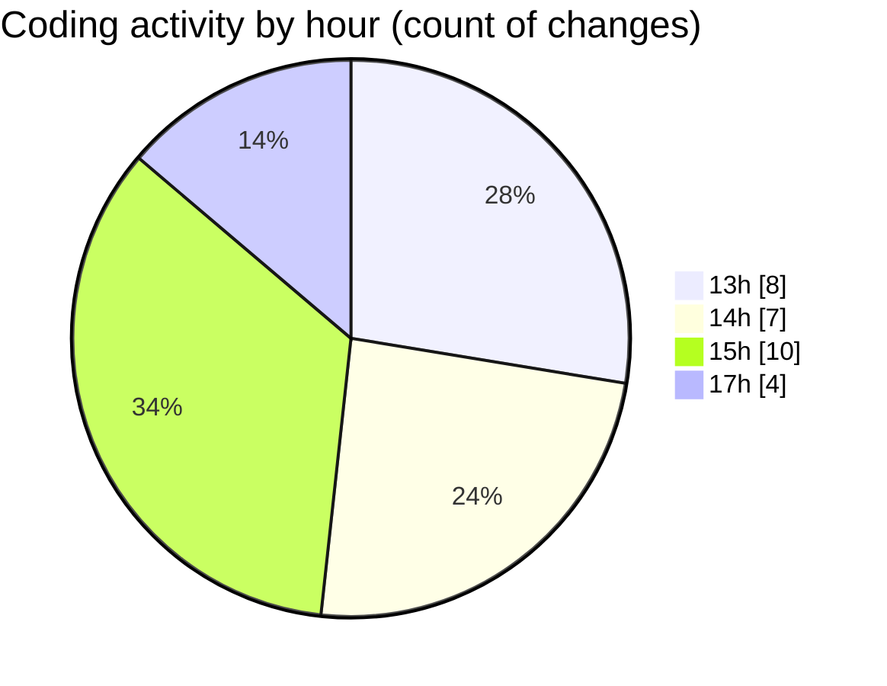

# JsVMS - Activity Summary 

## Overall Statistics

| Stat                   | Value                                                             |
| ---------------------- | ----------------------------------------------------------------- |
| **Lines Added** (➕)   | 1482                                          |
| **Lines Removed** (➖) | 149                                        |
| **Net Change** (↕)    | 1333                |
| **Active Time** (⌚)   | 40 minutes |

## Modified Files
- **server.js** (+57, -0)
- **addUser.js** (+182, -3)
- **user.js** (+159, -54)
- **userApi.js** (+82, -0)
- **userRoutes.js** (+94, -0)
- **selectbox.js** (+70, -0)
- **carApi.js** (+109, -0)
- **carRoutes.js** (+154, -0)
- **connection.js** (+135, -1)
- **addCar.js** (+205, -0)
- **car.js** (+95, -41)
- **vehicle.js** (+140, -50)

## Visualizations

### By File Type (Lines Changed)

### By Hour (Estimated Activity Count)

> **Last Updated:** 4/3/2025, 5:24:47 PM