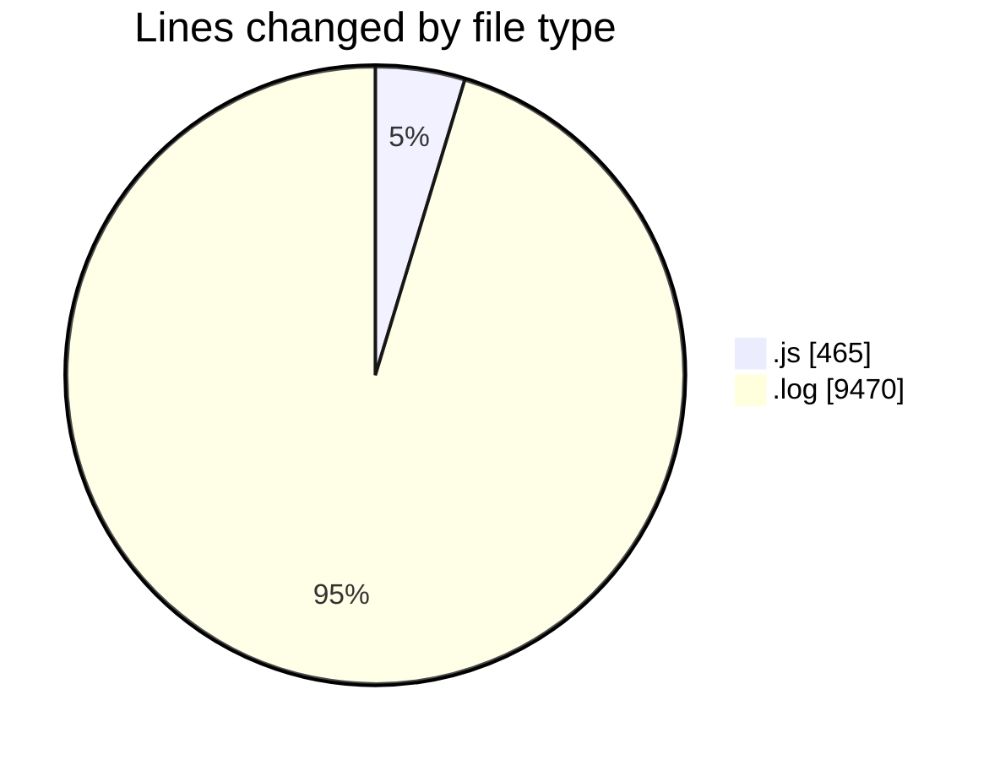
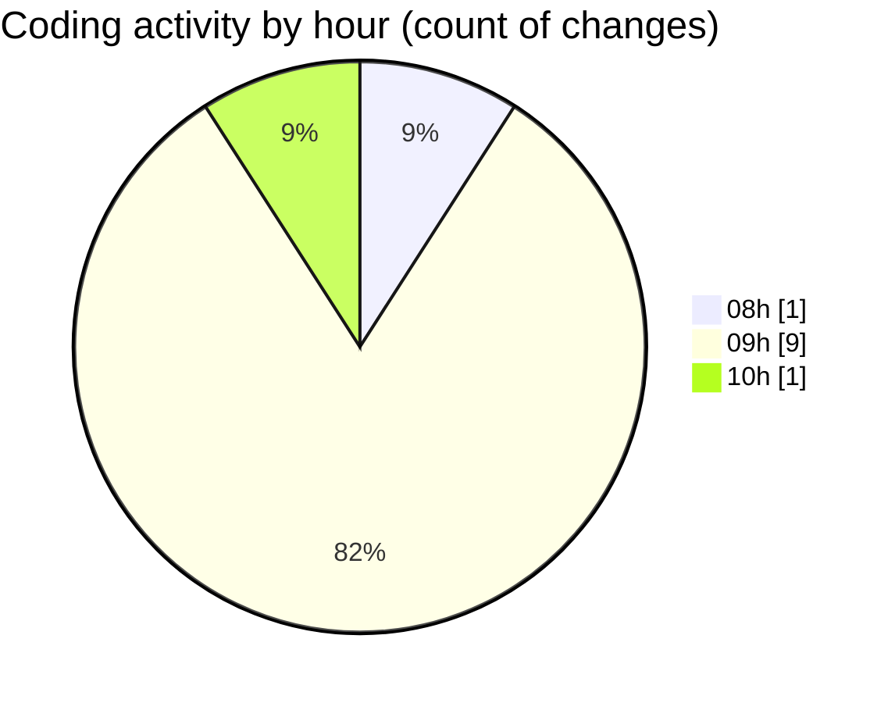

# JsVMS - Activity Summary 

## Overall Statistics

| Stat                   | Value                                                             |
| ---------------------- | ----------------------------------------------------------------- |
| **Lines Added** (➕)   | 9917                                          |
| **Lines Removed** (➖) | 18                                        |
| **Net Change** (↕)    | 9899                |
| **Active Time** (⌚)   | 18 minutes |

## Modified Files
- **userRoutes.js** (+94, -0)
- **applyFilters.js** (+81, -18)
- **index.js** (+103, -0)
- **populateFilters.js** (+34, -0)
- **server.js** (+54, -0)
- **car.js** (+81, -0)
- **access.log** (+9470, -0)

## Visualizations

### By File Type (Lines Changed)

### By Hour (Estimated Activity Count)

> **Last Updated:** 4/4/2025, 10:04:19 AM