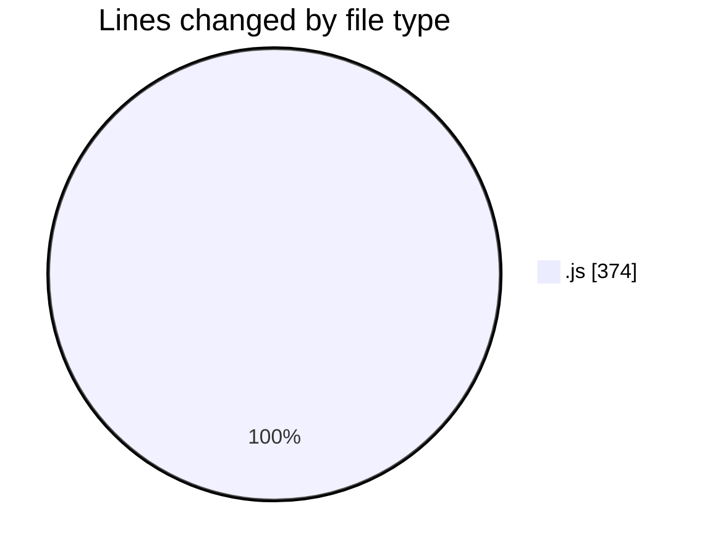
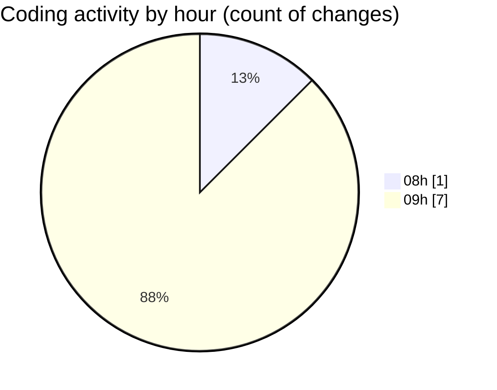

# JsVMS - Activity Summary 

## Overall Statistics

| Stat                   | Value                                                             |
| ---------------------- | ----------------------------------------------------------------- |
| **Lines Added** (➕)   | 366                                          |
| **Lines Removed** (➖) | 8                                        |
| **Net Change** (↕)    | 358                |
| **Active Time** (⌚)   | 14 minutes |

## Modified Files
- **userRoutes.js** (+94, -0)
- **applyFilters.js** (+81, -8)
- **index.js** (+103, -0)
- **populateFilters.js** (+34, -0)
- **server.js** (+54, -0)

## Visualizations

### By File Type (Lines Changed)

### By Hour (Estimated Activity Count)

> **Last Updated:** 4/4/2025, 9:34:19 AM