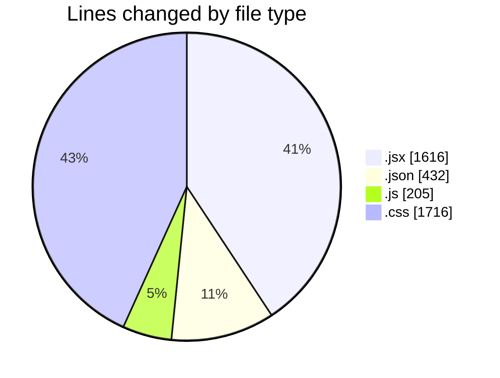
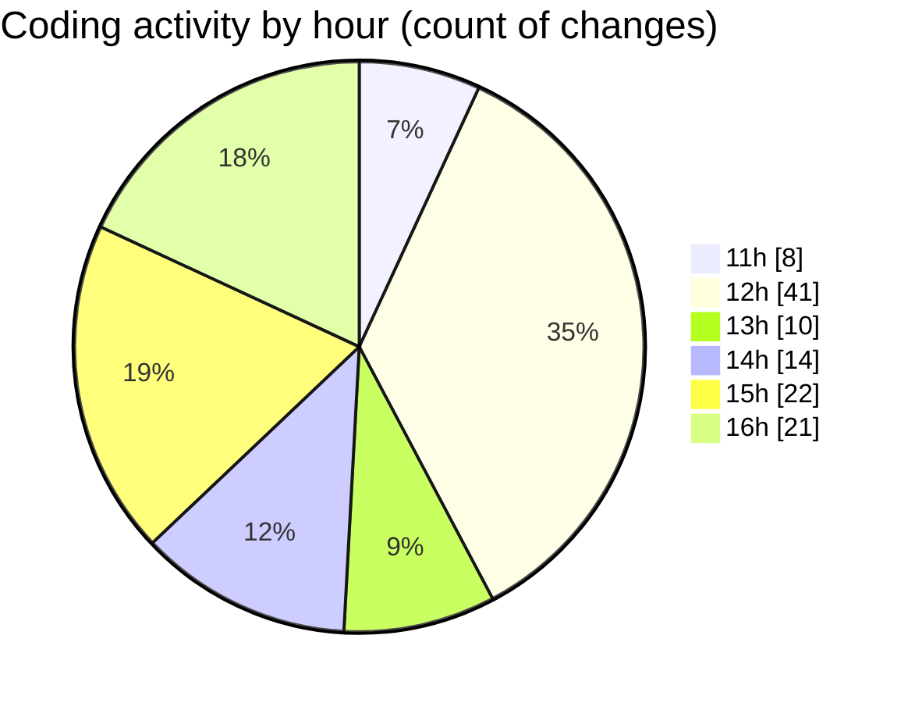

# Project - Activity Summary 

## Overall Statistics

| Stat                   | Value                                                             |
| ---------------------- | ----------------------------------------------------------------- |
| **Lines Added** (➕)   | 3002                                          |
| **Lines Removed** (➖) | 967                                        |
| **Net Change** (↕)    | 2035                |
| **Active Time** (⌚)   | 177 minutes |

## Modified Files
- **main.jsx** (+28, -0)
- **App.jsx** (+62, -0)
- **recipes.json** (+69, -0)
- **HomePage.jsx** (+243, -88)
- **FavoritesPage.jsx** (+80, -1)
- **RecipeForm.jsx** (+217, -73)
- **SearchFilter.jsx** (+43, -0)
- **FavoriteButton.jsx** (+48, -10)
- **RecipeDetail.jsx** (+251, -78)
- **RecipeList.jsx** (+60, -30)
- **RecipePage.jsx** (+178, -101)
- **favoritesSlice.js** (+54, -0)
- **store.js** (+13, -0)
- **Navbar.jsx** (+25, -0)
- **App.css** (+1124, -465)
- **recipes.json** (+69, -6)
- **server.js** (+46, -0)
- **package.json** (+15, -0)
- **server.js** (+92, -0)
- **recipes.json** (+158, -115)
- **index.css** (+127, -0)

## Visualizations

### By File Type (Lines Changed)

### By Hour (Estimated Activity Count)

> **Last Updated:** 5/4/2025, 4:43:00 PM