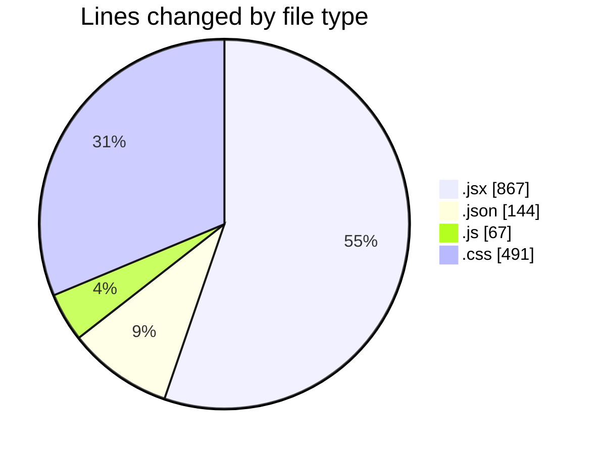
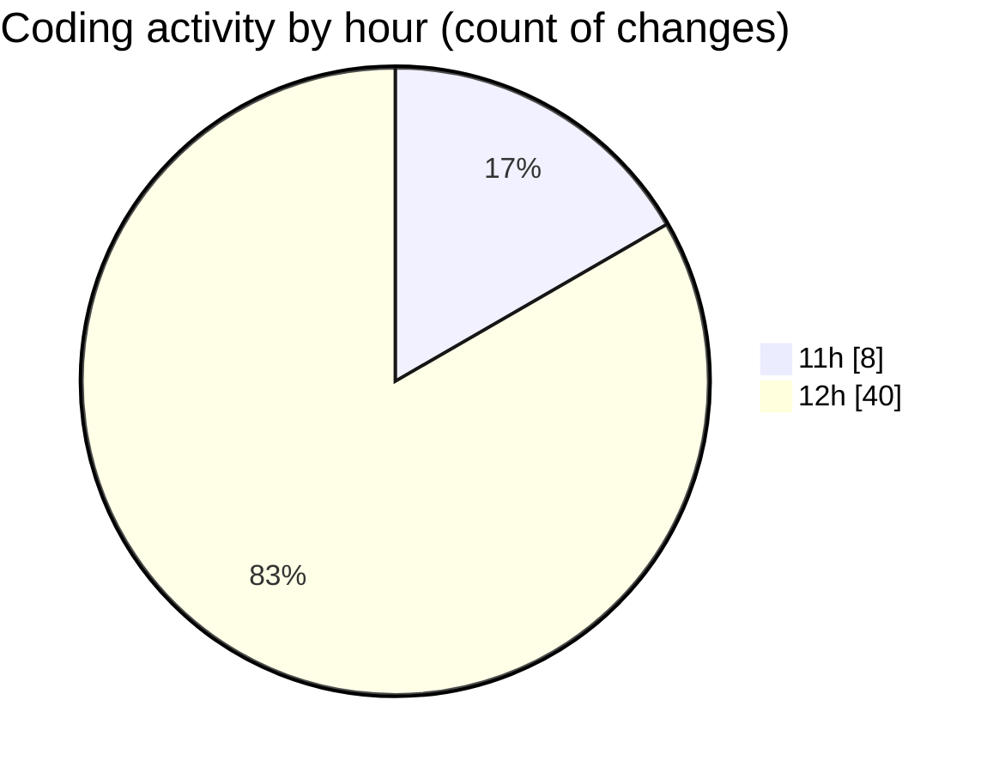

# Project - Activity Summary 

## Overall Statistics

| Stat                   | Value                                                             |
| ---------------------- | ----------------------------------------------------------------- |
| **Lines Added** (➕)   | 1349                                          |
| **Lines Removed** (➖) | 220                                        |
| **Net Change** (↕)    | 1129                |
| **Active Time** (⌚)   | 68 minutes |

## Modified Files
- **main.jsx** (+28, -0)
- **App.jsx** (+62, -0)
- **recipes.json** (+69, -0)
- **HomePage.jsx** (+121, -55)
- **FavoritesPage.jsx** (+64, -1)
- **RecipeForm.jsx** (+148, -12)
- **SearchFilter.jsx** (+43, -0)
- **FavoriteButton.jsx** (+48, -10)
- **RecipeDetail.jsx** (+51, -5)
- **RecipeList.jsx** (+60, -0)
- **RecipePage.jsx** (+88, -46)
- **favoritesSlice.js** (+54, -0)
- **store.js** (+13, -0)
- **Navbar.jsx** (+25, -0)
- **App.css** (+406, -85)
- **recipes.json** (+69, -6)

## Visualizations

### By File Type (Lines Changed)

### By Hour (Estimated Activity Count)

> **Last Updated:** 5/4/2025, 12:53:00 PM