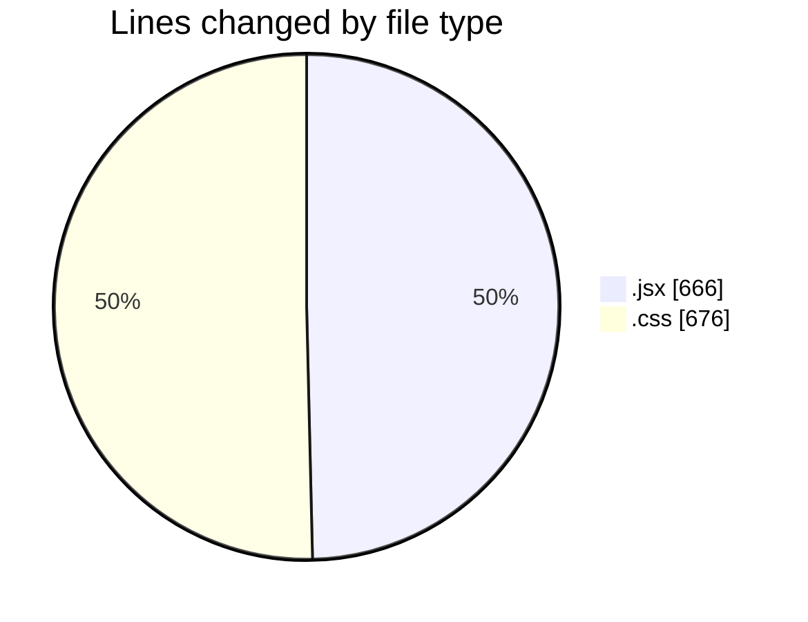
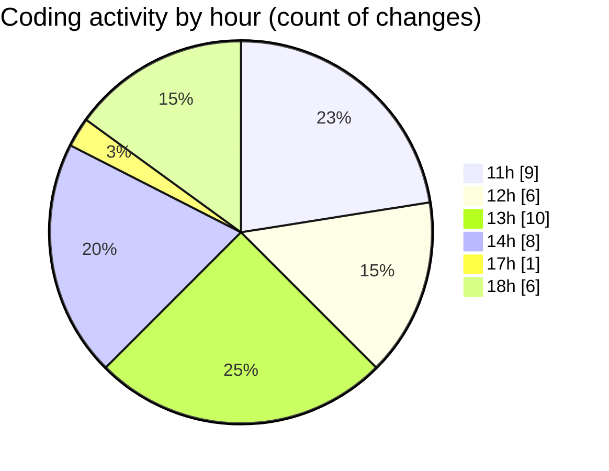

# recipe-app - Activity Summary 

## Overall Statistics

| Stat                   | Value                                                             |
| ---------------------- | ----------------------------------------------------------------- |
| **Lines Added** (➕)   | 1131                                          |
| **Lines Removed** (➖) | 211                                        |
| **Net Change** (↕)    | 920                |
| **Active Time** (⌚)   | 55 minutes |

## Modified Files
- **SearchFilter.jsx** (+69, -1)
- **HomePage.jsx** (+155, -1)
- **index.css** (+513, -163)
- **RecipeForm.jsx** (+255, -46)
- **FavoritesPage.jsx** (+99, -0)
- **Navbar.jsx** (+40, -0)

## Visualizations

### By File Type (Lines Changed)

### By Hour (Estimated Activity Count)

> **Last Updated:** 5/8/2025, 6:14:55 PM